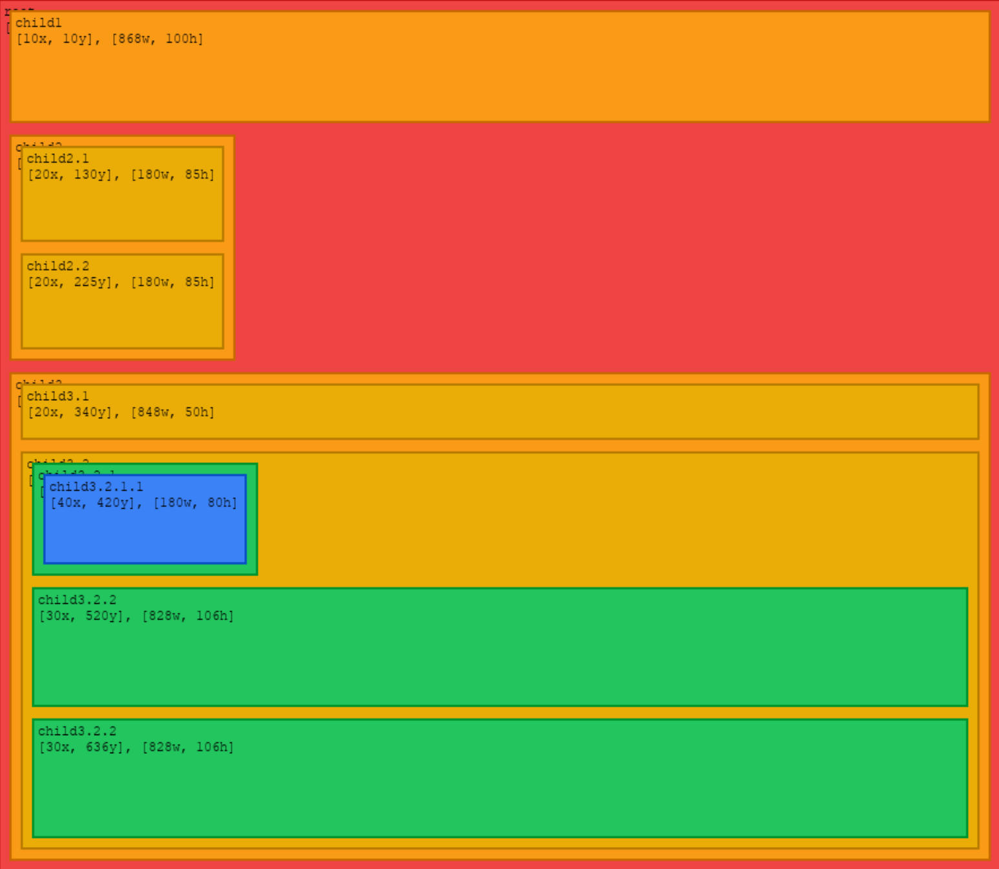

# UI Layout

## Overview

Algorithms for laying out GUI elements, written in Python for simplicity. Uses `pygame` to render GUIs.

## Rendering

1. `uv venv`
2. `.venv\scripts\activate`
3. `uv sync`

At this point you can run the simple CLI renderer.

4. `layout <name>`

> [!TIP]
> Example .html files can be found in `tests/fixtures/`.

## AI Usage

Used Copilot to generate/maintain tests.
