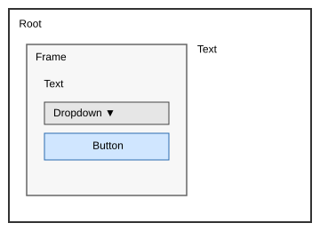
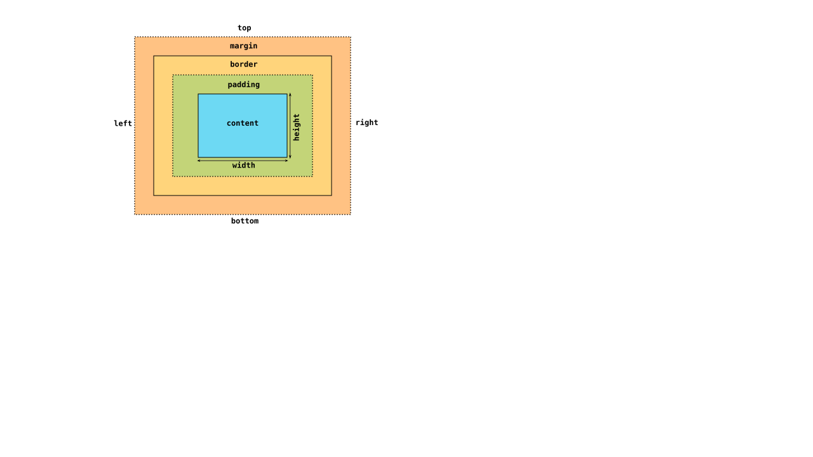

# 1. Getting Started

## Hierarchy

GUI layouts can be thought of as a tree structure, with branches
and leaves of the tree reperesenting the various elements within a GUI.

  

    

  

  

  

## Elements

An element is node within the GUI tree. It is most commonly represented 
rectangularly.

